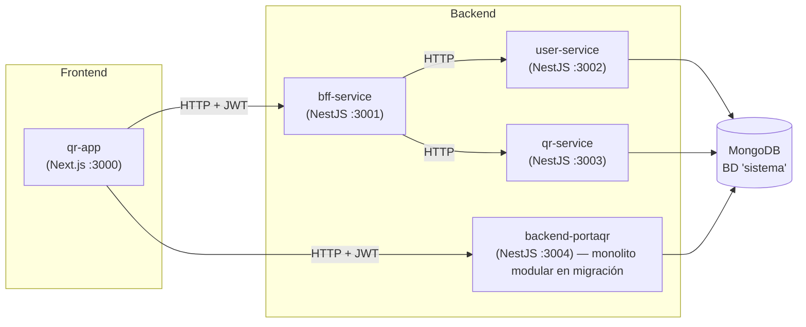

# PortaQR — Plataforma de Gestión de Códigos QR

Plataforma web para la **creación, gestión y seguimiento de códigos QR**. Permite generar códigos personalizados, activarlos por plan comercial, rastrear escaneos en tiempo real, gestionar pet-tags para mascotas y procesar pagos de suscripción vía Webpay (Transbank).

> [!IMPORTANT]
> Documentación técnica completa en [`docs/`](docs/) (vault Obsidian): especificaciones (`docs/spec/`) y decisiones de arquitectura (`docs/adr/`).

---

## ✨ Características

- **Gestión de códigos QR**: CRUD completo con tipos personalizados, SEO y URLs múltiples.
- **Activación de QR**: activación por código único vinculada a planes comerciales (`qr-activate`).
- **Generación gratuita de QR**: flujo libre con límites por usuario (`qr-free-generation`).
- **Pet-tags**: generación masiva, reserva, estado comercial y activación de tags para mascotas.
- **Escaneos y estadísticas**: registros de scans con detalle por día, ubicaciones, dispositivos y métricas por usuario o del sistema.
- **Planes**: administración de planes comerciales activos.
- **Pagos Webpay (Transbank)**: creación, retorno, reembolso y consulta de transacciones.
- **Autenticación JWT**: login, refresh y perfil con roles (`admin` / `user`) y guardas globales.
- **Email**: verificación de cuenta, reseteo de contraseña y formulario de contacto (Nodemailer + plantillas EJS).

---

## 🧱 Stack tecnológico

| Capa          | Tecnología                                                            |
| ------------- | --------------------------------------------------------------------- |
| Frontend      | Next.js 14 (App Router), React, TypeScript, Tailwind CSS              |
| Backend       | NestJS, TypeScript, Mongoose                                          |
| Base de datos | MongoDB (`sistema`)                                                   |
| Autenticación | JWT (backend), NextAuth (frontend)                                    |
| Pagos         | Webpay / Transbank (`transbank-sdk`)                                  |
| Email         | Nodemailer + plantillas EJS                                           |
| Infraestructura | Docker Compose, Railway                                              |

---

## 🏗️ Arquitectura

La plataforma sigue una topología **BFF + microservicios**, con una migración en curso hacia un **monolito modular** (ver [SPEC-001](docs/spec/SPEC-001-migracion-monolito-modular.md)).



> **Nota**: `bff-service`, `user-service` y `qr-service` están siendo unificados en `backend-portaqr` (SPEC-001). El frontend puede apuntar a cualquiera de los dos bordes durante la transición.

### Servicios y puertos

| Servicio        | Tecnología           | Puerto | Descripción                                    |
| --------------- | -------------------- | ------ | ---------------------------------------------- |
| `qr-app`        | Next.js 14           | 3000   | Frontend de la plataforma                      |
| `backend-portaqr` | NestJS            | 3004   | Monolito modular (fusión de los 3 servicios)   |
| `bff-service`   | NestJS               | 3001   | BFF (proxies hacia user/qr-service) — ⚠️ deprecado |
| `user-service`  | NestJS               | 3002   | Usuarios, auth (JWT), email — ⚠️ deprecado     |
| `qr-service`    | NestJS               | 3003   | Dominio QR: qr, scan, plan, pet-tag, webpay… — ⚠️ deprecado |
| `mongo`         | MongoDB              | 27017  | Base de datos `sistema`                        |
| `mongo-express` | mongo-express        | 8081   | UI de administración de MongoDB                |

---

## 🚀 Inicio rápido

### Requisitos previos

- Docker + Docker Compose
- Node.js 18+ (para desarrollo fuera de contenedores)

### Levantar el entorno completo

```bash
# Desde la raíz del entorno de desarrollo
docker compose up --build -d
```

Servicios disponibles tras el arranque:

| Servicio      | URL                                |
| ------------- | ---------------------------------- |
| Frontend      | http://localhost:3000              |
| API (BFF)     | http://localhost:3001              |
| Mongo Express | http://localhost:8081              |
| Healthcheck   | http://localhost:3001/health       |

### Configuración de entorno

Cada servicio lee su configuración desde su archivo `.env` (no versionado):

| Servicio         | Archivo env                |
| ---------------- | -------------------------- |
| `qr-app`         | `qr-app/qrApp.env`         |
| `bff-service`    | `bff-service/bffService.env` |
| `user-service`   | `user-service/userService.env` |
| `qr-service`     | `qr-service/qrService.env` |
| `backend-portaqr`| `backend-portaqr/backendPortaqr.env` |

> [!WARNING]
> Los archivos `.env` contienen secretos y **no se versionan**. Para crear un admin inicial: `npm run create:admin` dentro de `user-service` o `backend-portaqr`.

---

## 📁 Estructura del repositorio

```text
plataforma_qr_cursor/
├── desarrollo-qr/          # Ambiente de desarrollo (código fuente, NO versionado salvo compose)
│   ├── docker-compose.yml  # Orquestación local (versionado)
│   ├── mongo-init.js       # Inicialización de MongoDB
│   ├── backend-portaqr/    # Monolito modular NestJS (activo)
│   ├── qr-app/             # Frontend Next.js (activo)
│   ├── e2e-tests-portaqr/  # Tests E2E (activo)
│   ├── bff-service/        # BFF NestJS (deprecado → backend-portaqr)
│   ├── user-service/       # Microservicio usuarios (deprecado → backend-portaqr)
│   └── qr-service/         # Microservicio QR (deprecado → backend-portaqr)
├── docs/                   # Documentación (vault Obsidian)
│   ├── spec/               # Especificaciones técnicas (SPEC-XXX)
│   ├── adr/                # Decisiones de arquitectura (ADR-XXX)
│   └── backup-db/          # Backups de base de datos (no versionar)
└── .opencode/              # Configuración de agentes y skills
```

---

## 🔗 Repositorios

Cada componente del entorno se versiona en un repositorio remoto independiente:

### Activos

| Componente | Repositorio | Descripción |
| ---------- | ----------- | ----------- |
| `qr-app` | [FabioBustosTech/qr-app](https://github.com/FabioBustosTech/qr-app) | Frontend Next.js de la plataforma |
| `backend-portaqr` | [FabioBustosTech/backend-portaqr](https://github.com/FabioBustosTech/backend-portaqr) | Monolito modular NestJS (fusión de los 3 servicios) |
| `e2e-tests-portaqr` | [FabioBustosTech/e2e-tests-portaqr](https://github.com/FabioBustosTech/e2e-tests-portaqr) | Suite de tests E2E de la plataforma |

### Deprecados

> [!WARNING] Servicios deprecados
> Los siguientes repositorios fueron **unificados en `backend-portaqr`** como parte de la migración [SPEC-001](docs/spec/SPEC-001-migracion-monolito-modular.md). **No reciben desarrollo activo** y se conservan solo como referencia histórica (rollback y lectura).

| Componente | Repositorio | Estado |
| ---------- | ----------- | ------ |
| `bff-service` | [FabioBustosTech/bff-service](https://github.com/FabioBustosTech/bff-service) | ⚠️ Deprecado — fusionado en `backend-portaqr` |
| `user-service` | [FabioBustosTech/user-service](https://github.com/FabioBustosTech/user-service) | ⚠️ Deprecado — fusionado en `backend-portaqr` |
| `qr-service` | [FabioBustosTech/qr-service](https://github.com/FabioBustosTech/qr-service) | ⚠️ Deprecado — fusionado en `backend-portaqr` |

---

## 📚 Documentación

| Recurso | Descripción |
| ------- | ----------- |
| [SPEC-001](docs/spec/SPEC-001-migracion-monolito-modular.md) | Migración de 3 microservicios a monolito modular (`backend-portaqr`) |
| [ADR-001-01](docs/adr/ADR-001-01-monolito-modular-backend-portaqr.md) | Decisión: monolito modular backend-portaqr |
| [ADR-001-02](docs/adr/ADR-001-02-jwtstrategy-con-bd.md) | Decisión: JwtStrategy con consulta a BD |
| [ADR-001-03](docs/adr/ADR-001-03-controllers-user-qr-service-como-base.md) | Decisión: controllers de user/qr-service como base |

### API pública (contrato BFF)

| Módulo          | Ruta base            | Endpoints principales |
| --------------- | -------------------- | --------------------- |
| auth            | `/auth`              | `POST /login`, `POST /refresh` |
| users           | `/users`             | CRUD, `check-username`, `check-email`, reset password |
| qr              | `/qr`                | CRUD, `seo-idqr`, `public/:id`, `user/favorites` |
| scan            | `/scan`              | `POST /stats`, `/:id/stats`, `/:id/recent`, `/:id/daily`, `/:id/locations`, `/:id/devices` |
| plan            | `/plan`              | CRUD, `GET /active` |
| pet-tag         | `/pet-tag`           | `admin/generate`, `admin/reserved`, `public/status/:idQr`, `update/:petTagId`, `activate` |
| webpay          | `/webpay`            | `create`, `return`, `refund`, `status`, `transaction/:token` |
| qr-activate     | `/qr-activate`       | CRUD, `PATCH /webpay/:token_ws` |
| qr-free-generation | `/qr-free-generation` | CRUD básico |
| statistics      | `/statistics`        | `GET /user/:userId`, `GET /system` |
| mail            | `/mail`              | `POST /contact` |
| health          | `/health`            | `GET` |

---

## 🛠️ Desarrollo

### Flujo de trabajo

1. Las especificaciones técnicas viven en `docs/spec/SPEC-XXX-nombre.md`.
2. Se trabaja en **ramas feature** (nunca commit directo a `main`).
3. Todo el código TypeScript debe pasar `tsc` y los tests (`jest`) antes de commitear.
4. Los commits pasan hooks de Husky (lint + tests). No usar `--no-verify`.

### Comandos útiles

```bash
# Backend (dentro de un servicio)
npm run dev        # desarrollo con watch
npm run build      # compilación TypeScript
npm run test       # tests unitarios (Jest)

# Infraestructura
docker compose up --build -d        # levantar entorno
docker compose logs -f qr-app       # logs del frontend
```

---

## 🔐 Seguridad

- **JWT**: tokens firmados con `JWT_SECRET`; guarda global `JwtAuthGuard` + `RolesGuard` con roles `admin`/`user` y decorador `@Public()`.
- **Secretos**: todos los secretos se leen de archivos `.env` no versionados. El `docker-compose.yml` versionado no contiene secretos hardcodeados.
- **Autorización de recursos**: los controllers de `qr-service`/`backend-portaqr` validan propiedad del recurso (`ForbiddenException` si el usuario no es admin ni propietario).

---

## 📄 Licencia

Privado — uso interno del equipo de desarrollo.
